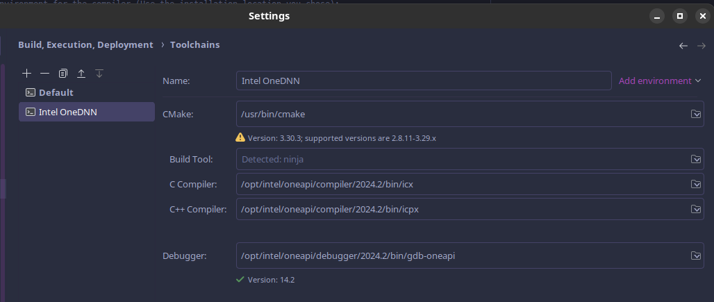
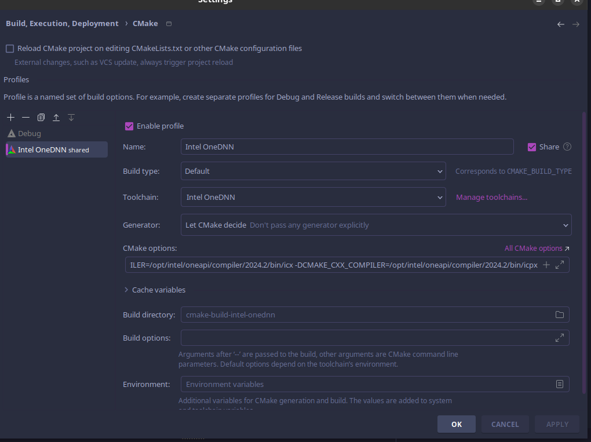

# resnet-intel-onednn

## Installation

### Linux

If on arch-based distro, install the basekit using:

```
yay -S intel-oneapi-basekit
```

Otherwise, follow the installation process here:

https://www.intel.com/content/www/us/en/developer/tools/oneapi/base-toolkit-download.html?operatingsystem=linux&distributions=offline

Root-based installations will set up the toolkit at `/opt/intel/oneapi`, while user-based ones in the home directory `~/intel/oneapi`

### Windows

https://www.intel.com/content/www/us/en/developer/tools/oneapi/base-toolkit-download.html?operatingsystem=window&distributions=offline

## Usage

### Environment setup

First, set up the environment for the compiler (Use the installation location you chose):

```
source /opt/intel/oneapi/setvars.sh
``` 

#### Fish shell

Use `bass` to source the file if you use `fish` as your shell https://github.com/edc/bass

```
bass source /opt/intel/oneapi/setvars.sh
``` 

### Compilation and execution

Compile the initial program using:

```
icpx -fsycl getting_started.cpp -o getting_started -ldnnl -tbb
```

Then run

```
./getting_started
```

The program should return `Example passed on CPU`

Feel free to experiment and familiarize yourself with the code.

## CLion setup

### Toolchains

Open `Settings -> Build, Execution, Deployment -> Toolchains`, then fill out the following values:



These should be based on the OneDNN installation path *(/opt/intel/oneapi) on Linux*

### CMake profile

Then check if the CMake profile is created:



The default profile is disabled for our purposes.

### Using the debugger

We found that compiling or debugging may not work unless you perform this trick:
> [!TIP]
> Instead of starting CLion normally, first source the OneDNN vars (`source /opt/intel/oneapi/setvars.sh` 
> or `bass source /opt/intel/oneapi/setvars.sh`), then start CLion using the CLI(`clion`) 

### Workflow

You should be able to build, execute and debug any program as it's done in any other IDE 